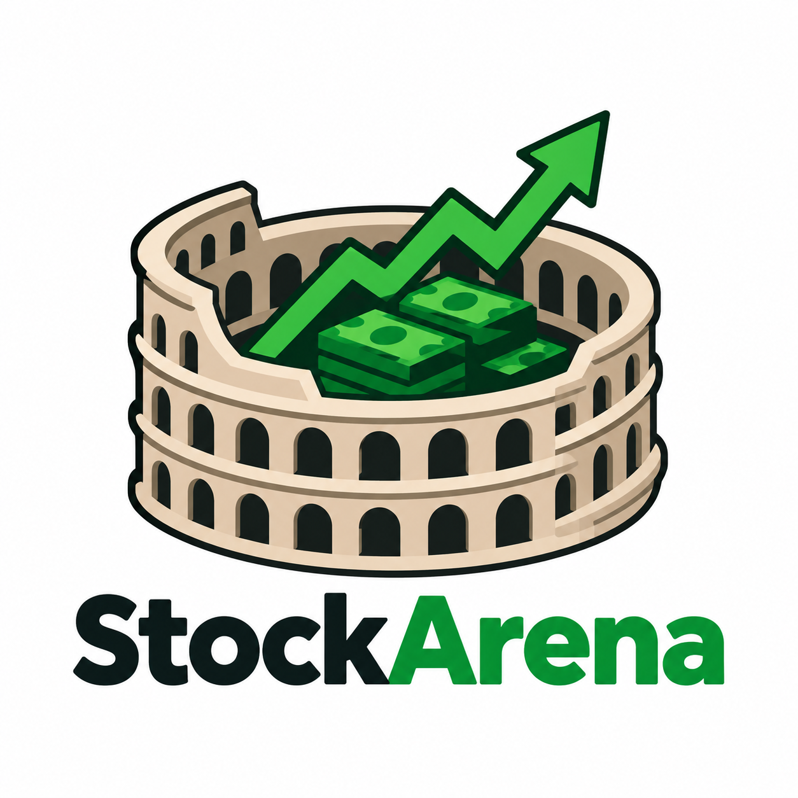

<p align="center">
  
</p>

# StockArena

**A weekly stock-picking competition. Real market prices, fake money, no real trades.**

StockArena is a game where players compete against each other by investing fake money into real stocks. Every week three leagues open — **1K ($1,000)**, **10K ($10,000)**, and **100K ($100,000)** — **open Monday 6:00 AM ET, close Sunday 7:00 PM ET**. You can join one, two, or all three at once, and you can join and add stocks **anytime** while the league is open — joining later just means less time for your stocks to grow. When you click **Join** on any league you enter its interface where you can see how much money you have, how much you've spent, and what stocks you've bought. You buy stocks at their real market price and during the week the value rises and falls with the real market — a simulation, but with real data. The same logic applies to 10K and 100K; only the starting money changes.

Players also earn achievements during the week, which pay out additional virtual money directly into their portfolio — a second way to grow their balance beyond the market itself. At the end of Sunday, the player whose portfolio has made the most money wins that league. Your finishing place in each league you joined pays **coins**, the game currency — and **currency and the money used to buy stocks are NOT the same**: coins are for the game (progression, chests, etc.), money is only for buying stocks inside a league.

## How a league week works

- **Monday 6:00 AM ET — Leagues Open.** Three leagues open: **1K** (you are given **$1,000**), **10K** ($10,000), and **100K** ($100,000). Join one or all three — each is a separate competition with its own portfolio. When you click **Join** you enter that league's interface where you see how much money you have, how much you've spent, and what stocks you've bought. You buy stocks at the real stock market price and during the week their value increases and decreases with the real market — a simulation with real data. Same logic for 10K and 100K, just more starting money. You can join and add stocks **anytime** while the league is open — later just means less time to grow. The first achievements become available immediately.
- **Monday 6:00 AM – Sunday 7:00 PM ET — Watch, Trade, Strategize.** Players track portfolio value, profit and loss, per-stock performance, league position, and the gap to the players above and below. Buy and sell stays open the whole week. Achievements unlock and pay cash into the available balance.
- **Sunday 7:00 PM ET — Leagues Close.** No new joins or trades after close. Final portfolio value, including all achievement money, decides the winner for each league you joined.

## Leagues and achievements

- **Real people, not bots — not a solo simulation.** Every league is live against other real players who joined that week. **Random leagues** match you against automatically selected real opponents; **private leagues** let friends set their own name, players, starting balance, schedule, and achievement settings. When you join a league you are placed in a room with real people and compete on the same live leaderboard.
- **Weekly achievements** (First Buy, Diversified, Comeback, Clean Sweep, Conviction, …) pay virtual money into the current league, so a player behind on the market can still climb.
- **Career achievements** (First Win, Three-Peat, Perfect Week, …) pay coins to your profile. Coins unlock higher leagues, extra private leagues, and customization — and are never spendable inside a league, so veterans never start a week richer than new players.
- **Two currencies, never mixed — `CURRENCY != LEAGUE MONEY`.** **Coins** are the persistent game currency earned by finishing place in each league (higher place = more coins). **League money** ($1,000 / $10,000 / $100,000) is only the cash you use to buy stocks inside that league, shown in the league interface as money / spent / holdings. Coins are for progression/chests and cannot buy stocks; league money cannot be earned as a reward and resets each week.

## Shape of the system

```
Railway                          Vercel
┌──────────────────┐            ┌──────────────┐
│ worker/          │            │ web/         │
│ polls quotes ────┼──┐      ┌──┼─ reads cache │
└──────────────────┘  │      │  └──────────────┘
                      ▼      │
              ┌───────────────┐
              │ Postgres      │
              │ (Railway)     │
              └───────────────┘
```

**One rule: nothing but the worker talks to the data vendor.** The worker polls
the tracked symbols on a fixed interval and writes to Postgres. Every client
reads the cache. This is what keeps a small free-tier rate limit survivable, and
it means prices tick on a schedule we control.

## Design — liquid glass, green and black

The web app is mobile-first and every surface is **liquid glass over an animated green and black gradient**. Cards, capsules, header, and the floating 5-tab bar (Home / Battles / Daily / Progress / Profile) are frosted glass with rim light, specular sheen, and depth over a drifting green/black mesh (transform/opacity only, paused for `prefers-reduced-motion`). The active tab uses a sliding glass lens. The system lives in `web/app/globals.css` and `web/styles/screens/` — keep new UI on that language.

## Layout

| Path | Runs on | What it is |
|---|---|---|
| `worker/` | Railway | Python price poller. Long-lived process. Config in `worker/railway.json`. |
| `web/` | Vercel | Next.js app (mobile-first, liquid-glass green/black): device sign-in, league picker, trading, portfolio, room leaderboard. `/status` shows the price cache. |

## Making changes

The code lives on this computer in `Documents\stockarena`. GitHub holds the
shared copy, and Railway and Vercel deploy from GitHub automatically.

1. Edit files here, locally.
2. Commit them.
3. Run `git push` from this folder in PowerShell.
4. Railway rebuilds `worker/` and Vercel rebuilds `web/` on their own.

Nothing is ever edited directly on GitHub, Railway, or Vercel. If code is ever
changed on GitHub, run `git pull` here before making new changes.

## Running the worker locally

No database needed — it runs in dry-run mode and prints quotes to the console.

```bash
cd worker
pip install -r requirements.txt
export FINNHUB_API_KEY=your_key
python poller.py
```

Set `MARKET_HOURS_ONLY=0` to poll outside the regular session.

## Environment

| Variable | Where | Notes |
|---|---|---|
| `FINNHUB_API_KEY` | worker | Data provider key. |
| `DATABASE_URL` | worker, web | Railway provides this. Unset = dry run. |
| `TICKERS` | worker | Comma-separated. Defaults to a test set. |
| `POLL_SECONDS` | worker | Default 60. |
| `MARKET_HOURS_ONLY` | worker | `1` to sleep when the market is closed. |

## Deploying

**Railway** — new project from this repo, root directory `worker`. Add a Postgres
database to the same project; Railway injects `DATABASE_URL` automatically. Set
`FINNHUB_API_KEY` in service variables.

**Vercel** — new project from this repo, root directory `web`. Add `DATABASE_URL`
as an environment variable, copied from Railway's Postgres connection string.

## Open before this grows

The gameplay plan is not final. Leagues, entries, and positions are deliberately
not modelled yet — only the price cache is. Two decisions gate the rest:

1. **Mobile-native or mobile web?** Determines whether `web/` is the real client
   or just a dashboard.
2. **Data provider and license.** Free tiers are typically personal,
   non-commercial use. Confirm redistribution is permitted before building on it.

The market-hours check in `poller.py` does not know about holidays or half-days.
It needs a real market calendar before it drives settlement.
